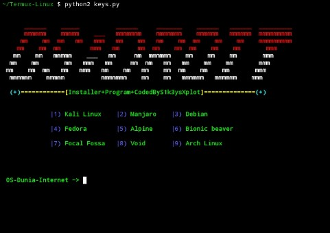

# OS-DROIT-Termux-Linux

Tujuan Materi disini Adalah Penginstalan Lingkungan Linux Di Android
Untuk Peningkatan Penetration Testing Di Android Seperti Di Kali Linux
Tapi Disini Saya Sediakan Beberapa Penginstalan Yang Lengkap!

• pertama penginstalan yang harus

$ pkg install root-repo

$ pkg install unstable-repo

$ pkg install x11-repo

• kedua penginstalan yang harus

$ pkg install wget curl proot tar -y

$ pkg install git

$ pkg install python2

$ git clone https://github.com/thony-gans/Termux-Linux

• Terakhir perintah yang harus dilakukan

$ cd Termux-Linux

$ python2 keys.py

° Maka Tampilan nya Akan Seperti ini °

setelah itu lakukan pemilihan sesuka mu

# Bantuan anda sangat membantu

Donate 💰: https://bit.ly/3xgl5LV

💪Subscribe juga YouTube kami🤖
https://youtu.be/yhdAT-gNN_E 👊

terimakasih😁
